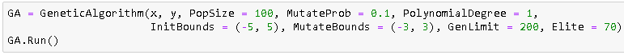

# Генетический алгоритм для подбора весов регрессионной модели

**График ошибки лучшей регрессионной модели в каждом поколении**

**Пример запуска программы**

**Передаваемые параметры:**
* PopSize - размер популяции
* MutateProb - вероятность мутации
* PolynomialDegree - степерь полинома
* InitBounds - границы, в которых генерируются коэффициенты особей начальной популяции
* MutateBounds - границы величины мутации
* GenLimit - максимальное количество поколений
* Elite - количество элитных особей